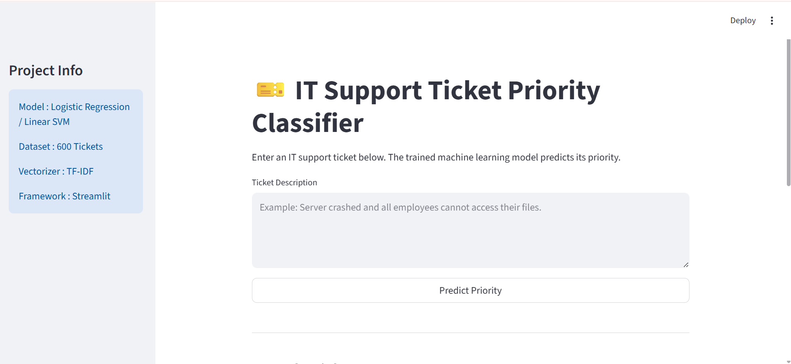
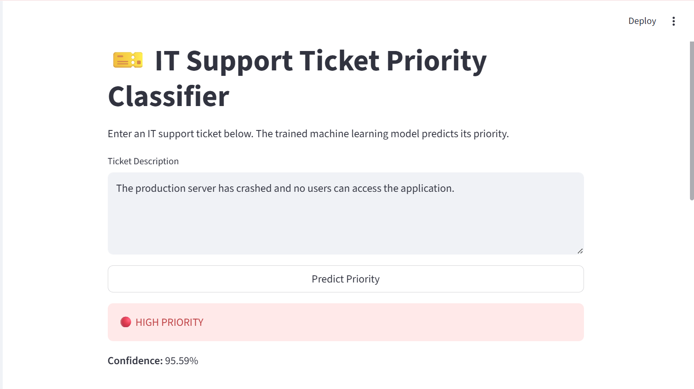
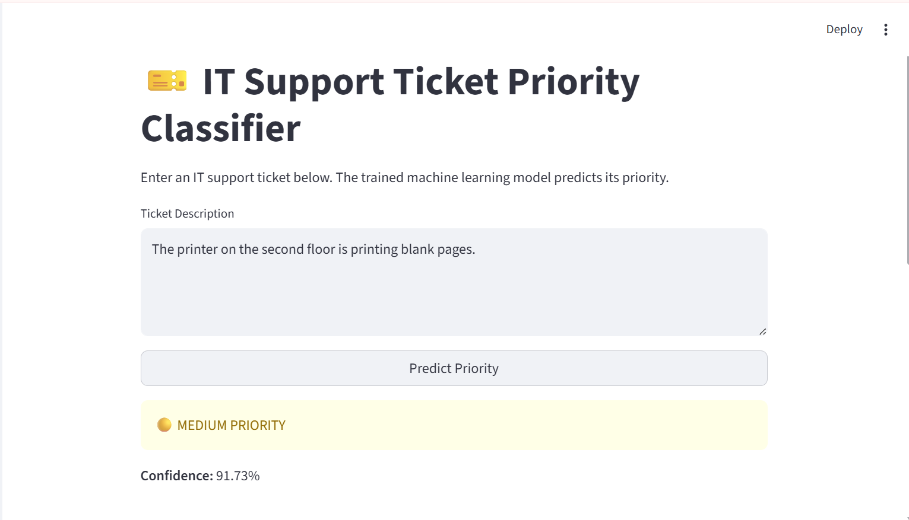
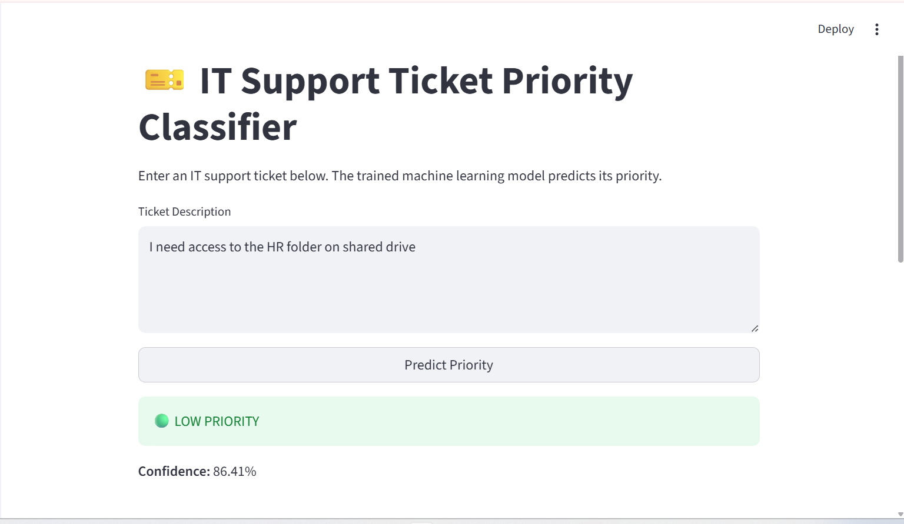

# 🎫 IT Support Ticket Priority Classifier using Machine Learning

## Overview

IT support teams receive hundreds of support tickets every day. These tickets may describe issues ranging from password resets to complete server failures.

Manually assigning priorities to every ticket is time-consuming and may lead to delays in resolving critical issues.

This project uses **Natural Language Processing (NLP)** and **Machine Learning** to automatically classify IT support tickets into one of the following priority levels:

- 🔴 High
- 🟡 Medium
- 🟢 Low

The project also includes an interactive **Streamlit Web Application** that allows users to enter a ticket description and instantly receive the predicted priority.

## Project Objectives

The main objectives of this project are:

- Automate IT ticket prioritization
- Reduce manual effort in ticket triaging
- Improve response time for critical issues
- Demonstrate the use of NLP in real-world applications
- Build a deployable Machine Learning application

## Features

- ✅ Automatic ticket priority prediction
- ✅ Text preprocessing using NLP
- ✅ TF-IDF feature extraction
- ✅ Machine Learning classification
- ✅ Comparison of multiple ML algorithms
- ✅ Hyperparameter tuning using GridSearchCV
- ✅ Cross-validation for model evaluation
- ✅ Streamlit web interface
- ✅ Real-time prediction
- ✅ Professional and easy-to-use interface

## Machine Learning Workflow

```text
IT Support Ticket
        │
        ▼
Text Preprocessing (NLP)
        │
        ▼
Lowercase → Remove Punctuation → Remove Stopwords → Lemmatization
        │
        ▼
TF-IDF Feature Extraction
        │
        ▼
Machine Learning Model Training
        │
        ├── Logistic Regression (Tuned)
        └── Linear SVM (Tuned)
        │
        ▼
Model Evaluation
        │
        ├── Accuracy
        ├── Precision
        ├── Recall
        ├── F1 Score
        ├── Confusion Matrix
        └── Cross Validation
        │
        ▼
Best Model Selected
        │
        ▼
Save Model (.pkl Files)
        │
        ▼
Streamlit Web Application
        │
        ▼
Predict Ticket Priority
```

## Dataset

The dataset contains approximately **600 IT support tickets**.

Each record contains:

| Column | Description |
|---|---|
| ticket_id | Unique Ticket ID |
| description | Ticket Description |
| category | Ticket Category |
| priority | Ticket Priority |

Priority labels: 🔴 High, 🟡 Medium, 🟢 Low

**Example:**

| Description | Priority |
|---|---|
| Server crashed and customers cannot access data | High |
| Printer is printing blank pages | Medium |
| Need Microsoft Word installed | Low |

## Technologies Used

- Python
- Pandas
- NumPy
- Scikit-Learn
- NLTK
- Matplotlib
- Seaborn
- Streamlit
- Joblib

## Machine Learning Models

The following Machine Learning models were implemented and compared.

### 1. Logistic Regression

A linear classification algorithm widely used for text classification.

Used with:
- TF-IDF Vectorizer
- Hyperparameter Tuning
- GridSearchCV

### 2. Linear Support Vector Machine (Linear SVM)

Linear SVM performs exceptionally well on text classification problems.

Used with:
- TF-IDF Vectorizer
- Hyperparameter Tuning
- GridSearchCV

### Baseline Model

Naive Bayes was initially trained as a baseline model for comparison purposes. The final deployed model was selected based on performance.

## Natural Language Processing Steps

The ticket descriptions undergo the following preprocessing steps before prediction:

```text
Original Ticket
      ↓
Convert to Lowercase
      ↓
Remove URLs
      ↓
Remove Numbers
      ↓
Remove Special Characters
      ↓
Remove Stopwords
      ↓
Lemmatization
      ↓
Clean Text
```

## Model Evaluation

The models were evaluated using multiple performance metrics:

- Accuracy
- Precision
- Recall
- F1 Score
- Classification Report
- Confusion Matrix
- 5-Fold Cross Validation

Using multiple evaluation metrics provides a more reliable assessment than accuracy alone.

## Project Structure

```text
IT-Ticket-Classifier/
├── app.py
├── notebook/
│   └── IT_Ticket_Classifier.ipynb
├── data/
│   └── tickets_dataset.csv
├── models/
│   ├── model.pkl
│   └── vectorizer.pkl
├── images/
├── requirements.txt
├── README.md
└── .gitignore
```

## Installation

Clone the repository:

```bash
git clone https://github.com/24CSB0B22/IT-Ticket-Classifier.git
```

Move into the project directory:

```bash
cd IT-Ticket-Classifier
```

Install the required packages:

```bash
pip install -r requirements.txt
```

## Running the Application

Start the Streamlit application:

```bash
streamlit run app.py
```

After running the command, Streamlit will automatically open the application in your browser.

## Sample Predictions

### Example 1

**Input**
```text
The production server has crashed and no users can access the application.
```

**Output**
```text
Priority: 🔴 High
```

### Example 2

**Input**
```text
The printer on the second floor is printing blank pages.
```

**Output**
```text
Priority: 🟡 Medium
```

### Example 3

**Input**
```text
Please install Microsoft Excel on my laptop.
```

**Output**
```text
Priority: 🟢 Low
```

## Screenshots

### 🏠 Home Page



---

### 🔴 High Priority Prediction



---

### 🟡 Medium Priority Prediction



---

### 🟢 Low Priority Prediction




## Future Improvements

Possible enhancements include:

- Fine-tune transformer models such as BERT
- Multi-language ticket support
- Predict ticket category in addition to priority
- REST API integration
- Cloud deployment using AWS or Azure
- Integration with ServiceNow or Jira
- Confidence calibration
- User authentication

## Requirements

- Python 3.10+
- streamlit
- pandas
- numpy
- scikit-learn
- nltk
- matplotlib
- seaborn
- joblib

Install all dependencies using:

```bash
pip install -r requirements.txt
```

## Learning Outcomes

Through this project, the following concepts were implemented and understood:

- Natural Language Processing
- Text Cleaning
- Stopword Removal
- Lemmatization
- TF-IDF Vectorization
- Logistic Regression
- Linear SVM
- Hyperparameter Tuning
- GridSearchCV
- Cross Validation
- Model Evaluation
- Streamlit Deployment
- Machine Learning Project Structure

## Author

**Lokesh Earothi**
B.Tech in Computer Science and Engineering
National Institute of Technology Warangal

---

⭐ If you found this project useful, please consider giving the repository a star on GitHub. It motivates future improvements and helps others discover the project.